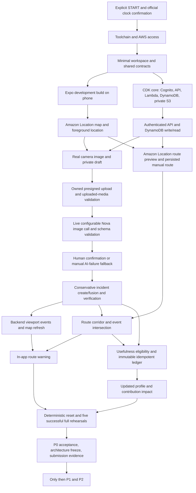

# JalNet implementation status

Planning audit: 2026-10-08, Asia/Kolkata. Source: [JalNet_Implementation_Plan.md](../JalNet_Implementation_Plan.md) (5,679 lines, numbered sections 0–100, including the addendum after the end marker). Explicit user instructions govern authorization and workflow; the plan supplies project requirements.

Application implementation has not been authorized. The initial audit created only the three planning documents. The user subsequently authorized a GitHub planning repository before START, including these documents, the unchanged source specification, README, TODO and `.gitignore`. The planning files have been published to the private [farhanakhtar0x66/jalnet repository](https://github.com/farhanakhtar0x66/jalnet), branch `main`, and the user explicitly chose to keep it private. No application code, dependency installation, project infrastructure, deployment or live AWS test has been created or performed. This publication exception does not open the implementation gate.

## Repository publication evidence

- Initial planning commit: `dc26f9d31cd86dd59098fbb28b25f8fc92f1b7fe`.
- `gh repo create farhanakhtar0x66/jalnet --private --description ... --source . --remote origin --push` succeeded; `main` tracks `origin/main`.
- GitHub REST repository metadata returned `private: true`, `default_branch: main` and the expected owner/repository URL.
- GitHub REST commit SHA matched `git rev-parse HEAD` for the initial push. The recursive remote tree contained exactly the seven intended files; every blob SHA matched `git ls-tree -r HEAD`.
- The supplied source plan was compared byte for byte with the original and remained unchanged. Local links, code fences, seven-file inventory, permitted status rows and a common credential-pattern scan passed.
- `git diff --cached --check` passed for newly authored files. The unchanged source plan retains its original Markdown hard-break spaces and final blank line, which the all-file whitespace check flags; it was not rewritten merely to remove them.
- The first proposed public create-and-push action was rejected by automatic approval review. No public repository was created; private creation succeeded, followed by the user's explicit private-visibility instruction.

This is documentation/repository evidence only. The application workspace, license, public submission access and all live product proofs remain incomplete.

## Initial audit evidence before repository publication

| Area | Observed result |
|---|---|
| Workspace | Initial `ls -la` showed only `.` and `..`; `rg --files --hidden -g '!.git' .` returned no files |
| Git | `git status --short --branch` and `git branch --all` each returned exit 128, not a Git repository; no `.git`, existing branches, remote, commits, or untracked Git state |
| Existing work | No mobile app, backend, infrastructure, manifests, lockfiles, configuration, tests, CI, generated files, or unfinished code |
| Instructions | No workspace `AGENTS.md`; no `AGENTS.md` found in inspected ancestor directories |
| JavaScript tools | `node --version`: `v26.10.0`; `npm --version`: `11.19.1`; `pnpm --version`: `11.25.0` through the bundled fallback; no project manager/version selected yet |
| AWS tooling | `aws` and `cdk` unavailable on PATH; conventional `~/.aws/config` and `~/.aws/credentials` absent; this does not prove other credential providers are unavailable |
| AWS resources/account | Not inspected or provisioned; credentials, Cognito, Location key, model access, IAM, quotas, and deployed endpoints remain unverified |
| Java | `java -version`: Temurin OpenJDK `25.0.4.1`; `/usr/libexec/java_home -V` listed a JRE; `javac -version` failed because no compiler-capable runtime was found |
| Android | SDK exists at `~/Library/Android/sdk`; platforms `android-34`, `android-35`, `android-37.0`; build-tools `34.0.0`, `36.0.0`; adb/emulator binaries exist but are absent from PATH |
| adb probe | Absolute-path `adb version` aborted attempting to create `~/.android` outside the permitted write roots; neither device connectivity nor an adb version was verified |
| Apple tooling | `/Applications/Xcode.app` absent; `xcodebuild -version` failed because active tools are CommandLineTools; local iOS build not available in this audited configuration |
| Device | Physical demo Android phone availability and connectivity not verified |
| Tests/builds | No runnable project exists; no formatter, lint, typecheck, unit/integration test, CDK synth, mobile build, or end-to-end test was run |

Tool presence is not runtime compatibility evidence. Select and pin compatible Node, package manager, Expo, React Native, MapLibre, JDK, Android, SDK, CDK, and Lambda runtime versions after authorization, using current official documentation.

## Dependency analysis

Critical path: real map → real capture → private S3 → live Nova assessment → human confirmation → incident create/fusion → map refresh → persisted saved-route intersection → route warning → useful contribution award. Auth, schemas, owned-media validation, verification, and idempotency are prerequisites across that path. Route creation can be prepared independently once the provider works, but route-risk acceptance also depends on incident fusion and event freshness.

## Proposed first milestone after START

Phase 0 is the integration proof from §99, preceded only by the minimum workspace/contracts/infrastructure needed to run it. The first 30 minutes are a diagnostic target, not a promise that provisioning/native builds finish within 30 minutes.

Exit evidence must include:

1. A real Expo development build installs and starts on the target phone.
2. MapLibre loads Amazon Location style, tiles, glyphs, and sprites using the restricted map key; attribution remains visible.
3. Foreground location works; denial still permits chosen-area use.
4. API Gateway/Lambda returns and protected requests use Cognito.
5. DynamoDB completes an actual write/read.
6. A phone image reaches private S3 by presigned PUT, with ownership/type/size checked after upload.
7. An available, configurable Nova model/inference profile receives a real image; returned text is parsed and validated against the assessment contract.
8. Amazon Location calculates a real route through the backend.

Record failures at the relevant boundary and continue independent authorized work. Elaborate UI and stretch features wait for these proofs. Follow with phases 1–7 from the user request: shell, event system, reporting, fusion, route intelligence, droplets, reliability. Run appropriate checks and update this matrix at each gate.

## P0 requirement matrix

Verification entries distinguish existing planning/repository evidence from required future product evidence. `VERIFIED` is reserved for executed checks or concrete inspected artifacts. Allowed statuses: `NOT_STARTED`, `IN_PROGRESS`, `BLOCKED`, `IMPLEMENTED_UNVERIFIED`, `VERIFIED`. No complete P0 product requirement is currently verified.

| ID | Requirement | Spec section | Priority | Dependencies | Status | Verification |
|----|-------------|--------------|----------|--------------|--------|--------------|
| GATE-01 | Explicit authorization and official project clock before implementation | Header, 1, 7, 46, 93, 94; user §§4,21 | P0 | User START | BLOCKED | Pending — user confirmation; no code or provisioning beforehand |
| P0-001 | Git/workspace, package manager, reproducible compatible versions | 7, 46, 48 | P0 | GATE-01 | IN_PROGRESS | Planning Git repository published; application manifests, lockfile and clean install pending START |
| P0-002 | Shared strict Zod API/domain/media contracts | 8, 10, 43.2, 81 | P0 | P0-001 | NOT_STARTED | Pending — valid and invalid request/output contract tests |
| P0-003 | Pure domain/geo functions and persistence/provider boundaries | 6.3, 28, 78 | P0 | P0-002 | NOT_STARTED | Pending — domain tests independent of AWS; provider review |
| P0-004 | One infrastructure framework: CDK TypeScript | 7, 37, 77 | P0 | P0-001 | NOT_STARTED | Pending — synth and template security validation |
| P0-005 | Expo development/native build on target Android phone | 6.1, 43.4, 94, 99 | P0 | P0-001; B-02; B-04 | NOT_STARTED | Pending — physical-device install/start evidence |
| P0-006 | MapLibre with real Amazon Location dynamic Monochrome map | 6.2, 77, 97, 99 | P0 | P0-005; B-03 | NOT_STARTED | Pending — device style/tile/glyph/sprite rendering and attribution |
| P0-007 | Restricted expiring client map key; maps direct, routes backend | 97.2–97.3 | P0 | P0-004, P0-006 | NOT_STARTED | Pending — action/resource/client restriction inspection and device requests |
| P0-008 | Cognito identity, API authorizer, owner isolation | 6.8, 31.5, 97.1 | P0 | P0-004; B-03 | NOT_STARTED | Pending — authenticated success; unauthenticated and other-owner denial |
| P0-009 | API Gateway/Lambda and actual DynamoDB write/read | 6.3, 9, 37, 99 | P0 | P0-002, P0-004, P0-008 | NOT_STARTED | Pending — live endpoint response and persisted round trip |
| P0-010 | Launch directly into quiet map; minimal navigation and center camera | 2, 4, 34, 35.3 | P0 | P0-005, P0-006 | NOT_STARTED | Pending — physical-device fresh-launch and control walkthrough |
| P0-011 | Foreground-only location, permission primer, accuracy disclosure | 13.3, 31.3, 35.2 | P0 | P0-005 | NOT_STARTED | Pending — allow, low-accuracy, deny and permission-revocation cases |
| P0-012 | Chosen-area/demo-area fallback and recenter | 0.2, 35.2, 36, 56 | P0 | P0-010, P0-011 | NOT_STARTED | Pending — usable map/report pin without GPS permission |
| P0-013 | Canonical layer sheet and truthful feature availability | 4.3, 12, 35.6, 68 | P0 | P0-010, P0-002 | NOT_STARTED | Pending — Live/flood/leaks/drains filtering; unavailable controls disabled/labeled |
| P0-014 | TanStack Query server state and small Zustand UI state | 79, 80 | P0 | P0-001, P0-002 | NOT_STARTED | Pending — state ownership and invalidation review |
| P0-015 | Event/report persistence, timestamps, point plus semantic radius | 8.1–8.2, 9, 83, 85, 86 | P0 | P0-002, P0-009 | NOT_STARTED | Pending — repository round trips; distinct severity/impact/confidence/time fields |
| P0-016 | H3 coarse index, neighboring cells, exact geometry filtering | 6.4, 9.1, 11, 15, 40 | P0 | P0-003, P0-015 | NOT_STARTED | Pending — boundary-cell retrieval and exact-filter tests |
| P0-017 | Bounded viewport API returning public map-card data | 10.2, 11.2, 88 | P0 | P0-008, P0-016 | NOT_STARTED | Pending — bbox/cell/result caps, layer filter, dedupe and private-field exclusion |
| P0-018 | Debounced padded viewport queries and cached layer keys | 11.1, 80, 88 | P0 | P0-014, P0-017 | NOT_STARTED | Pending — pan/query trace, cache behavior and no per-frame calls |
| P0-019 | GeoJSON source clustering and freshness/provenance markers | 11.3, 12, 89 | P0 | P0-006, P0-017 | NOT_STARTED | Pending — cluster/zoom behavior; Single report versus Community verified |
| P0-020 | Event detail, readable observations, sources, age and uncertainty | 35.5, 53, 55, 57, 89 | P0 | P0-019, P0-002 | NOT_STARTED | Pending — detail API/UI walkthrough without raw reporter/private media fields |
| P0-021 | Real camera JPEG capture; denial/settings and close paths | 13, 35.7, 43.4, 69 | P0 | P0-005, P0-011 | NOT_STARTED | Pending — actual image capture and denied-camera manual walkthrough |
| P0-022 | Image resizing/compression and configured hard limits | 13.2, 31.7, 38, 50 | P0 | P0-021 | NOT_STARTED | Pending — image byte/dimension evidence; oversize/unsupported type tests |
| P0-023 | Private draft with capture/upload provenance and editable pin | 8.2, 13.3, 30.3, 83, 84 | P0 | P0-002, P0-011, P0-021 | NOT_STARTED | Pending — draft round trip; coordinate accuracy; no public EXIF/identity |
| P0-024 | Report state machine and idempotent legal transitions | 8.2, 41.1, 82 | P0 | P0-023, P0-003 | NOT_STARTED | Pending — success, repeated requests, invalid transition and failure tests |
| P0-025 | Private encrypted S3, Block Public Access and constrained IAM | 6.5, 31.4–31.5, 37.2 | P0 | P0-004 | NOT_STARTED | Pending — synthesized/deployed bucket and per-service policy inspection |
| P0-026 | Owned presign request, randomized key, short expiry and caps | 10.3, 31.7 | P0 | P0-008, P0-023, P0-025 | NOT_STARTED | Pending — wrong-owner/state/type/size rejected; valid short-lived URL |
| P0-027 | Real direct phone-to-S3 upload with progress and retry errors | 10.3, 13, 69, 99 | P0 | P0-022, P0-026 | NOT_STARTED | Pending — actual private object and mobile progress/failure evidence |
| P0-028 | Validate actual uploaded media before worker; completion trigger | 10.3, 14.1, 31.5 | P0 | P0-024, P0-027; B-05 | NOT_STARTED | Pending — missing/wrong-size/wrong-type/other-owner object denial; one analysis job |
| P0-029 | Async analysis worker, bounded retry and polling | 14.1, 37, 41.1 | P0 | P0-028, P0-004 | NOT_STARTED | Pending — queue/worker state transitions, retry/DLQ behavior and latency |
| P0-030 | Live configurable Nova image model/inference profile | 6.6, 14, 98, 99 | P0 | P0-029; B-03 | NOT_STARTED | Pending — real account/region invocation with captured image; no fixture substitution |
| P0-031 | Conservative prompt and exact assessment contract | 8.3, 14.2–14.5, 26.2, 94 | P0 | P0-002, P0-030 | NOT_STARTED | Pending — schema tests; no depth/flow/contamination/ownership assertions |
| P0-032 | Parse/validate, at most one retry, manual failure path | 14.5, 36, 44.2, 69 | P0 | P0-024, P0-031 | NOT_STARTED | Pending — malformed JSON, timeout/throttle and irrelevant/uncertain outputs retain draft |
| P0-033 | Editable human confirmation and still-active check before publication | 13.4, 35.9, 83 | P0 | P0-032 | NOT_STARTED | Pending — user changes category/pin/note; no public event before confirmation |
| P0-034 | Idempotent confirmation and transactional incident/report consistency | 10.3, 15, 41, 82 | P0 | P0-033, P0-015 | NOT_STARTED | Pending — double-submit/concurrent/replayed request yields one linked outcome |
| P0-035 | Configurable type/distance/time fusion candidates and score | 15.1–15.2 | P0 | P0-016, P0-034 | NOT_STARTED | Pending — type windows, spatial/time boundaries and ambiguous separate-event tests |
| P0-036 | Merge report count/freshness and robust severity aggregation | 15.3, 86 | P0 | P0-035 | NOT_STARTED | Pending — merge/create tests; no unconditional maximum-severity escalation |
| P0-037 | System confidence independent of model confidence | 14.4, 53, 86 | P0 | P0-036 | NOT_STARTED | Pending — quality/corroboration tests; model confidence not displayed as truth |
| P0-038 | Verification, conflicting observations and monitoring/resolution | 15.4, 30.6–30.7, 41.2, 54 | P0 | P0-036, P0-037 | NOT_STARTED | Pending — independent evidence, contradiction and resolution tests |
| P0-039 | Basic independent confirm/cleared/not-sure; no self-confirmation | 5, 10.2, 30.6 | P0 | P0-008, P0-020, P0-038 | NOT_STARTED | Pending — two identities; proximity/abuse checks; same-user refusal |
| P0-040 | Logical event expiry while retaining incident history | 9.1, 30.7, 41.2, 59 | P0 | P0-038 | NOT_STARTED | Pending — freshness filters and retained history; TTL never silently erases canonical evidence |
| P0-041 | Immediately invalidate events, route risks and profile after confirm | 35.10, 80, 69 | P0 | P0-014, P0-034, P0-036 | NOT_STARTED | Pending — confirmed event appears without relaunch; stale caches refreshed |
| P0-042 | Manual route origin/destination pins and named save workflow | 17.1, 35.11, 56 | P0 | P0-010, P0-012, P0-002 | NOT_STARTED | Pending — route creation using current location or manual pins |
| P0-043 | Backend Amazon Location route preview, caching and rate limits | 10.4, 17.1, 88, 97.3, 99 | P0 | P0-008, P0-009; B-03 | NOT_STARTED | Pending — actual calculated route; provider failure and bounded request tests |
| P0-044 | Private encoded route/corridor/bbox persistence and owner checks | 8.4, 9.3, 10.4, 31 | P0 | P0-042, P0-043 | NOT_STARTED | Pending — save/load across launch; other-user geometry access denied |
| P0-045 | Route deletion cancels its warnings; no background tracking | 18, 31.3, 60, 77 | P0 | P0-044 | NOT_STARTED | Pending — route-delete risk removal and absence of background permission/tasks |
| P0-046 | H3 corridor candidates and exact point-to-segment/radius intersection | 17.2, 40.3 | P0 | P0-003, P0-016, P0-044 | NOT_STARTED | Pending — crossing/near-miss/long-segment/boundary tests and saved route integration |
| P0-047 | Severity/confidence/freshness route-risk threshold | 17.2, 19, 86 | P0 | P0-037, P0-040, P0-046 | NOT_STARTED | Pending — fresh/stale/resolved and unverified-event risk tests |
| P0-048 | Saved-route polyline, affected area and useful in-app warning | 17.4, 29.2, 35.4, 69 | P0 | P0-019, P0-047, P0-041 | NOT_STARTED | Pending — new report changes map and warning for persisted route |
| P0-049 | Truthful lower-reported-risk wording and no dead Alternative action | 2.5, 17.3, 35.4, 61, 67 | P0 | P0-048, P0-013 | NOT_STARTED | Pending — copy/control audit; route alternatives remain disabled/hidden until P1 works |
| P0-050 | Immutable ledger and atomic idempotency independent of GSI uniqueness | 8.5, 9.4, 16, 82 | P0 | P0-002, P0-009 | NOT_STARTED | Pending — repeated/concurrent award requests create exactly one entry |
| P0-051 | Accepted relevant provisional value; verified/usefulness awards delayed | 2.6, 16.2, 35.10, 94.7 | P0 | P0-038, P0-047, P0-050 | NOT_STARTED | Pending — no raw-upload points; eligibility and capped-impact award tests |
| P0-052 | Anti-farming: per-user repeats, caps, self-verify prevention, rate limits | 16.4, 30, 31.6, 69 | P0 | P0-039, P0-051 | NOT_STARTED | Pending — duplicate/repeat/daily-cap/abuse tests; perceptual hashing deferred to P1 |
| P0-053 | Reversals use audit entries; trust separate from cosmetic rank | 16.3–16.4, 30.5, 60 | P0 | P0-050, P0-052 | NOT_STARTED | Pending — ledger reversal and rank-does-not-prove-truth tests |
| P0-054 | Profile balance/useful contributions and real impact update | 4.5, 35.15, 69 | P0 | P0-008, P0-041, P0-051 | NOT_STARTED | Pending — ledger-derived profile; no invented people/litres-saved numbers |
| P0-055 | Public incidents exclude identity, private routes and private-property precision | 31.1–31.4, 84 | P0 | P0-017, P0-023, P0-044 | NOT_STARTED | Pending — response/privacy review; private coordinates never leak via public pins |
| P0-056 | Originals/EXIF stay private; public preview optional and sanitized | 6.7, 31.4, 59 | P0 | P0-025, P0-028, P0-055 | NOT_STARTED | Pending — unauthorized object access denied; no original publicly displayed |
| P0-057 | Least-privilege roles, encryption, env separation and no secrets | 31.5, 37.2–37.3, 38, 97 | P0 | P0-004, P0-007, P0-008, P0-025 | NOT_STARTED | Pending — synth/IAM and tracked-file/mobile-bundle review; `.env.example` only |
| P0-058 | Throttling, per-user limits, payload/media quotas and bounded H3 fanout | 31.6, 88 | P0 | P0-008, P0-017, P0-026, P0-043 | NOT_STARTED | Pending — adversarial request/quota tests and config inspection |
| P0-059 | Canonical useful errors without stack traces or sensitive logs | 36, 39.1, 81 | P0 | P0-002, P0-009 | NOT_STARTED | Pending — denial/validation/provider errors and redacted log review |
| P0-060 | Observability and honest health; no per-health Bedrock call | 39, 50 | P0 | P0-009, P0-030 | NOT_STARTED | Pending — health configured-versus-probed distinction, metrics and bounded logs |
| P0-061 | Map loading, calm empty state, stale timestamps and network fallback | 32.2–32.3, 36 | P0 | P0-010, P0-018 | NOT_STARTED | Pending — empty/API failure/offline/stale-cache manual matrix |
| P0-062 | Durable local draft/media metadata, retryable upload and cached route/events | 33, 43.4 | P0 | P0-023, P0-024, P0-027, P0-044 | NOT_STARTED | Pending — capture offline/restart/retry without lost draft or duplicate submit |
| P0-063 | Honest stage indicators and actionable camera/AI/route failure states | 35.8, 36, 69 | P0 | P0-024, P0-032, P0-043 | NOT_STARTED | Pending — injected failures allow recovery; stages match actual work |
| P0-064 | Performance budgets measured on target device and viewport backend | 11.3, 32, 88 | P0 | P0-018, P0-019, P0-048 | NOT_STARTED | Pending — launch/map/camera/pan/API timings and payload size; targets not claims |
| P0-065 | Accessible touch targets, labels, contrast and non-color status | 34.6, 57 | P0 | P0-010, P0-020, P0-033, P0-048 | NOT_STARTED | Pending — physical-device accessibility and text-size walkthrough |
| P0-066 | English copy keys, uncertainty/provenance, sparse-data Jal Pulse | 20, 53, 58, 61, 89 | P0 | P0-002, P0-019, P0-037 | NOT_STARTED | Pending — copy and missing-data review; no fabricated scientific index |
| P0-067 | Deterministic labeled demo seeds for one Delhi/NCR area and route | 42.1–42.2, 90 | P0 | P0-015, P0-044 | NOT_STARTED | Pending — inspect seed disclosure; live capture adds relevant waterlogging |
| P0-068 | Demo reset restricted to demo data and restores all implemented state | 42.3, 69, 90 | P0 | P0-050, P0-067 | NOT_STARTED | Pending — actual reset restores reports/events/routes/ledger; no unrelated data deletion |
| P0-069 | Live core remains real; recording-only AI fixture visibly disclosed | 44.2, 69, 90 | P0 | P0-030, P0-068 | NOT_STARTED | Pending — live execution evidence; fixtures never counted as live Bedrock acceptance |
| P0-070 | Fusion, verification, expiry, report transitions and route unit tests | 43.1; user §12 | P0 | P0-035, P0-038, P0-040, P0-046 | NOT_STARTED | Pending — executed focused unit tests with recorded results |
| P0-071 | API/assessment valid, missing, unknown-category and confidence tests | 43.2 | P0 | P0-002, P0-031 | NOT_STARTED | Pending — executed schema suite including rejected bad inputs |
| P0-072 | S3-analysis, confirmed-report fusion, route warning and ledger integrations | 43.3 | P0 | P0-028, P0-030, P0-036, P0-048, P0-050 | NOT_STARTED | Pending — executed integrations; distinguish local fixtures from cloud evidence |
| P0-073 | Formatting, lint, typecheck, tests, synth and appropriate builds per phase | 43, 49; user §§12–13 | P0 | P0-001, P0-004, P0-005 | NOT_STARTED | Pending — exact commands/results logged and regressions fixed at each gate |
| P0-074 | CI install/typecheck/lint/unit/synth without broad PR deployment credentials | 49 | P0 | P0-073 | NOT_STARTED | Pending — workflow inspection and executed CI run |
| P0-075 | Physical Android permission/offline/upload/AI/duplicate/layers/route matrix | 43.4–43.5 | P0 | P0-048, P0-054, P0-062, P0-063 | NOT_STARTED | Pending — recorded manual scenarios; second screen size where available |
| P0-076 | Five consecutive complete live rehearsals from clean demo reset | 42.3, 46, 69 | P0 | P0-068, P0-072, P0-075 | NOT_STARTED | Pending — five recorded reset → capture → warning → eligible droplets runs |
| P0-077 | Budget/request/log controls and feature kill switches | 50, 67, 68 | P0 | P0-004, P0-013, P0-030 | NOT_STARTED | Pending — configuration/quotas review; optional features removable without core failure |
| P0-078 | Architecture freeze after phone/map/API/S3/AI/fusion/route/reset proofs | 100 | P0 | P0-076 | NOT_STARTED | Pending — evidence-backed freeze; no dependency major upgrades afterward |
| P0-079 | README, architecture/privacy/source/demo docs and honest limitations | 62, 64, 65, 93 | P0 | P0-072, P0-075 | IN_PROGRESS | Planning README/source/status/TODO published; implementation, privacy and demo evidence docs pending |
| P0-080 | Public repo, licenses, attribution and AI coding tool disclosure | 1, 48, 64, 93 | P0 | P0-001, P0-057, P0-079 | IN_PROGRESS | Private repository and planning AI attribution verified; public visibility explicitly deferred; license/submission review pending |
| P0-081 | Sub-three-minute video showing live critical loop and AWS | 63, 69, 93 | P0 | P0-076, P0-079 | NOT_STARTED | Pending — measured video duration, signed-out YouTube link and visible AWS/data disclosure |
| P0-082 | Final write-up/submission before verified official deadline | 1, 65, 93 | P0 | P0-080, P0-081; B-01 | NOT_STARTED | Pending — exact published deadline and submission receipt; no guessed schedule |

## Deferred scope and acceptance gates

P1 begins only after the P0 loop is reliable: Water Stress with actual/documented input and missing-component renormalization tests; simulated My Water with forecast/baseline/anomaly tests; basic clearly labeled demo tanker quotes/reservations; official alerts; video; push; route alternatives. Basic independent incident confirmation is kept in P0 to support credible verification and rewards; the broader second-user workflow is deferred.

P2/later: background route learning, HeatSafe, advanced DrainScan, supplier optimization, auto-reserve, sensor hardware, payments, municipal operations, predictive flood models, PostGIS migration, multi-city production. No custom tile server, Kubernetes, social feed/chat, CV training pipeline, elaborate admin suite, or speculative service sprawl.

Kill switches follow §68. Disabled stretch features must disappear or clearly state unavailability. Seeded incidents are disclosed; no live core dependency is replaced by an unlabeled simulation. Stress/tank tests in §43 apply when those deferred algorithms are implemented, not as a reason to build them before P0.

## Planning validation

Full spec/request read and initial read-only audit completed. Current official-source findings and unresolved interpretation details are recorded in `DECISIONS.md`; prerequisites and exact unblock actions are in `BLOCKERS.md`.

Executed a one-off Node stdin validation of the planning files: exactly three documents, 83 unique matrix rows (82 P0 requirements plus the authorization gate), seven columns per row, permitted statuses only, all referenced requirement dependencies present, pending evidence clearly labeled, no VERIFIED product rows, balanced code fences, blank lines after headings, and final newlines. Result: PASS, exit 0. `rg --files --hidden -g '!.git' .` listed only the three requested Markdown documents; repeat Git status/branch checks each returned exit 128 as expected. No product test/build/synth was run. These documentation checks cannot verify any product feature.
